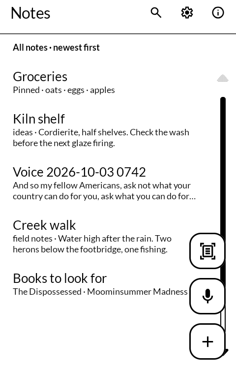
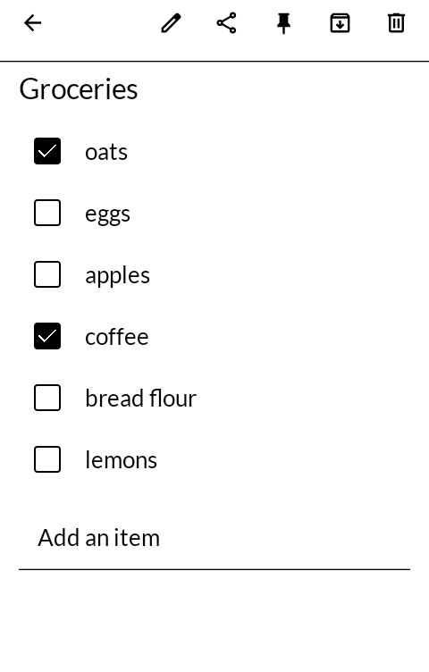
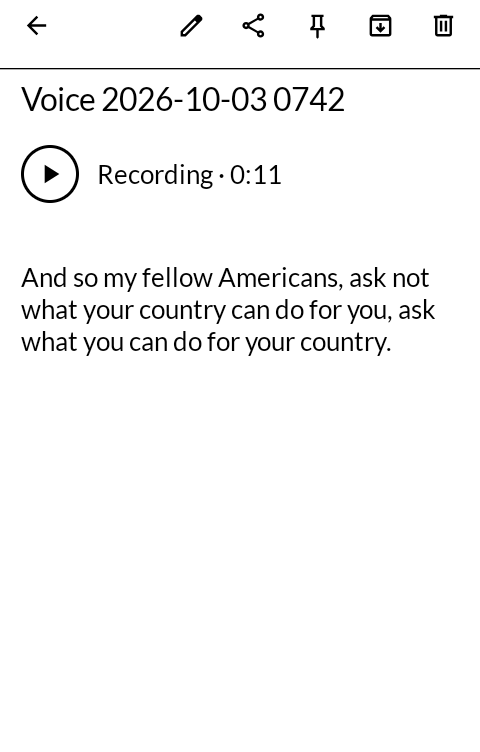
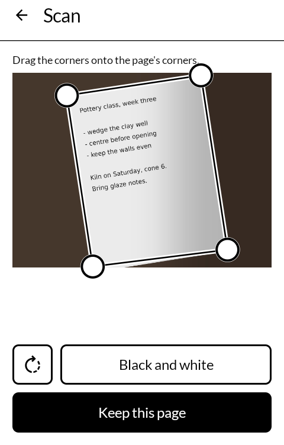

# 覚書 oboegaki — Notes

Notes, lists, voice notes and scanned paper, kept as plain Markdown files in a folder you
choose: on your own Nextcloud, or anywhere on the phone. Built for the
[Mudita Kompakt](https://mudita.com/products/kompakt/) and its E Ink screen.

*Oboegaki* is 覚書, a memorandum: a thing written down so that it is not forgotten.

Not a fork. Written from scratch in Kotlin and Jetpack Compose, using Mudita's own
[MMD](https://github.com/mudita/MMD) design system, with speech recognition by
[whisper.cpp](https://github.com/ggml-org/whisper.cpp) running on the phone itself.

| | |
|---|---|
|  |  |
|  |  |

## Where this is up to

Version 0.1.3. On a Kompakt: notes and lists syncing through Nextcloud
between two phones, a list shared between them and ticked on one while added to on the other,
a voice note heard and written down, a page photographed and handed to the scanner.

## What it does

- **Notes** are Markdown files. A note's title is its file name, and folders are folders, so
  the same notes open as they are in Obsidian or any editor on a computer.
- **Lists** are ordinary `- [ ] milk` lines. A note with tasks in it opens as a list: a tick is
  one tap, and an item is added from the foot without opening the keyboard over the list.
- **Voice notes.** The microphone starts recording at once and keeps going with the screen
  off. Stopping makes a note with the recording beside it, linked the way Obsidian links
  (`![[Voice 2026-10-03 0742.m4a]]`), and plays it in place. Then the phone listens to it and
  writes the words under the link; on a Kompakt that takes about as long as the recording.
  It hears English only, and it mishears: the recording stays, and is the real one.
- **Scans.** A photograph of a page, from a camera app or one already taken. The page's
  corners are guessed and dragged where the guess is wrong, and it can be turned a quarter at
  a time. Each page is straightened and kept in black and white, in greys, or in color, and the
  pages become one PDF beside a note that shows them. There is no live preview, which on E Ink
  would be a smear, and no reading of the words on the page.
- **One list of everything**, the last note touched at the top, its folder named on the row.
  The line above it narrows the list to lists, voice notes, scans, shared notes, a folder, or
  the archive, and orders by newest, oldest or title. The magnifier searches titles and text.
- **Pinned** notes stay at the top. **Archived** notes move to an `Archive` folder, out of every
  view but their own, and a search still finds them.
- **From anywhere**: text shared from another app, or selected and sent with *Note*, becomes a
  note; an article or page shared with its name becomes a note called that, holding a Markdown
  link to it. New note and Record are shortcuts on the icon; a Markdown or text file opened
  from Files is shown, and kept as a note if you want it.
- **Pictures** shared from a gallery, a camera app or Files become a note that shows them, in
  greys at the width of the screen, with the pictures beside it (`![[Picture 2026-10-05
  1412.jpg]]`); or they are scanned, each one a page of the same PDF.
- **Remind me**, in the note's menu, opens a calendar app's new event with the note's title and
  words already in it; the day and the time are chosen there.
- **On the lock screen**, through [Glance](https://github.com/wanderwildwood/hitome), the pinned
  notes, and how much of each list is left to do.

## Where the notes are kept

**On a Nextcloud.** You sign in on the server's own page, which gives this phone a password of
its own that you can take back from the server's security settings. The notes are kept on the
phone as well, so they open with no signal, and are synced when the server can be reached:
when the app opens, after an edit, and every half minute while a note is open.

When the same note has been changed in two places, the changes are put together line by line.
Two people adding to a list at once both keep their additions. Where the same line was changed
two different ways there is no right answer, and both versions are kept, the other one as
`name (this phone).md`. Nothing is dropped to make a sync come out tidy.

**In a folder on the phone**, chosen through the system's picker. Nothing is synced by this
app; if another app syncs that folder, the notes go wherever it takes them.

**Changing your mind.** *Notes kept in*, at the top of the settings, offers the same two
places again. With *Bring these notes along* on, the notes, and the recordings, scans and
pictures beside them, are copied to the new place; the old place keeps every one. A note
already there under the same name with different words is not written over: the one coming in
is kept beside it as `name (other copy).md`.

### With Obsidian

A vault is a folder of Markdown files, so Notes can keep its notes in one. Obsidian itself is
free; what is needed is something to keep the phone's folder and the computer's the same.

- **Obsidian Sync.** Install Obsidian on the phone and open the synced vault once. Obsidian
  keeps it in its own storage, where no other app can reach it, so in *Manage vaults* move the
  vault to a folder such as `Documents`, then choose that folder (or a folder inside it) in Notes.
- **[Syncthing](https://syncthing.net/)**, free, from the phone to the computer with no server
  in between. On Android it is the Syncthing-Fork app. Sync a folder on the phone to one on the
  computer, choose the phone's in Notes, and open the computer's as a vault. Both have to be on
  for the changes to cross.
- **Nextcloud.** Keep the notes on Nextcloud, and let the Nextcloud desktop app keep the folder
  on the computer, to open as a vault.

## Sharing

On Nextcloud, a note can be shared with anyone else on the same server, to read or to change.
It is the server's own sharing, so both people's phones sync the one file. A note shared with
you is moved into your notes folder and marked as shared.

## For other apps

Other apps can write notes in through a content provider, `com.wanderwildwood.oboegaki.capture`.
Everything is a `ContentResolver.call(uri, method, arg, extras)` that returns a Bundle with
`ok`, and when `ok` is false a `reason`:

| method | arg | extras | does |
|---|---|---|---|
| `ready` | | | `ok` if there is somewhere to keep notes, else `not_set_up` |
| `put` | a path such as `Dreams/2026-10-05 0712.md` | `text` | makes that note, or replaces its text; folders are made as needed, and it syncs like any edit |
| `remove` | the same kind of path | | deletes that note and nothing else; `ok` if it was already gone |

A path is relative to the notes folder, ends in `.md`, and has no `..`, no leading `/` and no
hidden names; anything else is `bad_path`. A failure is `failed`, with a `message`.

Only apps on a list in `capture/CaptureProvider.kt` get an answer, each known by its package name
and the SHA-256 of the certificate it is signed with; any other caller is `refused`. Dream Log
(`com.wanderwildwood.yumecho`) is the first. An app on the list should also name
`com.wanderwildwood.oboegaki` in its manifest's `<queries>`, so Android lets it see this one.

## Permissions

- `INTERNET`, to reach a Nextcloud. Kept in a folder, nothing leaves the phone. Plain `http` is
  allowed, for a server at home or on Tailscale; over `http` on an ordinary network the notes
  and the app password can be read by anyone else on it, so give a server that has `https`
  as `https`.
- `RECORD_AUDIO`, asked the first time the microphone is pressed and not before.
  `FOREGROUND_SERVICE` and `WAKE_LOCK`, so a recording carries on with the screen off; Android
  shows a notification while it does.
- No camera permission: a camera app takes the photograph.

The words are worked out on the phone. Recordings go nowhere but where the notes go.

## Size

About 65 MB, nearly all of it the speech model, `ggml-base.en-q5_1` (57 MB, English only), the
same one [Dream Log](https://github.com/wanderwildwood/yumecho) uses.

## Getting it, and keeping it

Download <https://github.com/wanderwildwood/oboegaki/releases/latest/download/oboegaki.apk> and
sideload it. That address always points at the newest release, and every release publishes a
`.sha256` beside the APK if you would rather check than trust.

For updates without doing this by hand, add this repository to
[Obtainium](https://github.com/ImranR98/Obtainium):

    https://github.com/wanderwildwood/oboegaki

**The application id is settled**: updates install over what you have, keeping your notes and
settings.

## Building

```
sh models/fetch.sh        # downloads the speech model and checks it by hash
./gradlew assembleRelease
```

A release is signed by a keystore in `signing/`, which is not in this repository. Without it
the release APK builds **unsigned** and will not install anywhere; there is no fallback key by
design.

## Licence

GNU General Public License v3.0 only. Copyright wander wildwood.

Bundled, under their own licences:

- [whisper.cpp](https://github.com/ggml-org/whisper.cpp) v1.9.4, MIT, in
  `app/src/main/cpp/whisper.cpp`, trimmed to the parts an Android CPU build compiles
- OpenAI's [Whisper](https://github.com/openai/whisper) model, MIT, as converted by the
  whisper.cpp project
- [OkHttp](https://square.github.io/okhttp/), Apache 2.0
- Icons from [Material Symbols](https://fonts.google.com/icons), Apache 2.0
